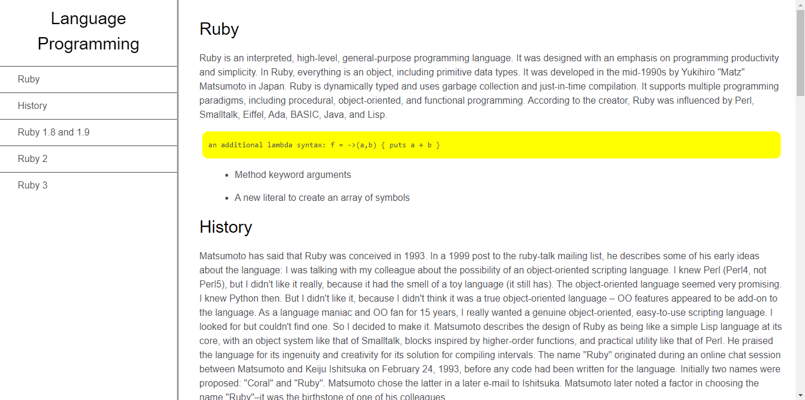

# Project Name

> https://camo.githubusercontent.com/76f7e3d7f9171cb46f2c8db03265814719aa1395f4e874f446efef29f9b8f0d6/68747470733a2f2f696d672e736869656c64732e696f2f62616467652f76697375616c25323073747564696f253230636f64652d3030374143433f7374796c653d666f722d7468652d6261646765266c6f676f3d76697375616c73747564696f636f6465266c6f676f436f6c6f723d303037414343266c6f676f53697a653d6175746f266c6162656c436f6c6f723d7768697465

Additional description about the project and its features.

## Built With

- Major languages
- Frameworks
- Technologies used

## Live Demo

[Live Demo Link](https://diegoneitorex.github.io/Documentation-Page/)

## Getting Started

**This is an example of how you may give instructions on setting up your project locally.**
**Modify this file to match your project, remove sections that don't apply. For example: delete the testing section if the currect project doesn't require testing.**

To get a local copy up and running follow these simple example steps.

### Prerequisites

### Setup

### Install

### Usage

### Run tests

### Deployment

## Authors

👤 **Diego Andres Rivero Fernandez**

- GitHub: [@Diegoneitorex](https://github.com/Diegoneitorex)
- Twitter: [@Diegoneitorex](https://twitter.com/Diegoneitorex)

## 🤝 Contributing

Contributions, issues, and feature requests are welcome!

Feel free to check the [issues page](https://github.com/Diegoneitorex/Documentation-Page/issues).

## Show your support

Give a ⭐️ if you like this project!

## Acknowledgments

- Hat tip to anyone whose code was used
- Inspiration
- etc

## 📝 License

This project is [CC0 1.0 Universal](LICENSE) licensed.